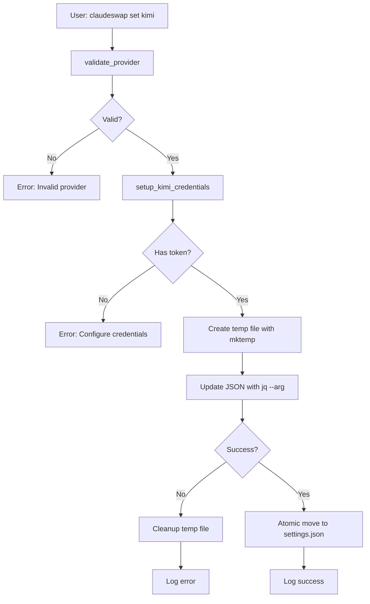
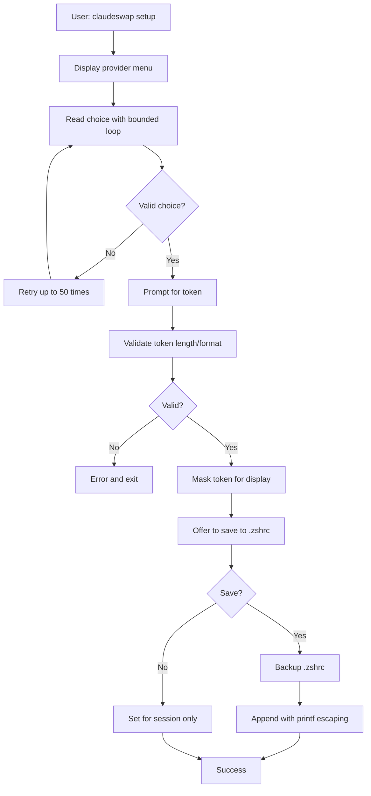

# Architecture Documentation

## Overview

Claude Swap is a modular, security-hardened command-line tool for managing Claude AI API configurations across multiple providers. The architecture follows TIGERSTYLE principles and NASA's 10 Rules for safety-critical code.

## Design Principles

### 1. TIGERSTYLE
- **Simple Control Flow** - No recursion, explicit structures only
- **Fixed Limits** - All loops and queues have upper bounds
- **Minimal Abstractions** - Clean modular architecture (9 files)
- **Zero Technical Debt** - Production-ready code quality

### 2. NASA's 10 Rules Compliance
1. ✅ Simple control flow (no recursion, goto, setjmp)
2. ✅ Fixed loop bounds (all loops bounded)
3. ✅ No dynamic memory allocation
4. ✅ Functions under 70 lines
5. ✅ Enhanced error checking throughout
6. ✅ Minimal variable scope
7. ✅ All return values checked
8. ✅ Limited preprocessor use
9. ✅ Restricted pointer use
10. ✅ Strict error handling (`set -euo pipefail`)

### 3. Security First
- No hardcoded credentials
- Input validation on all user data
- Injection prevention (shell, JSON, command)
- Atomic file operations with cleanup traps

## Module Structure

```
homebrew-claudeswap/
├── claudeswap                      # Main executable (373 lines)
│   ├── Command routing
│   ├── Provider switching logic
│   └── Settings file management
│
├── lib/
│   ├── constants.sh                # Configuration constants (66 lines)
│   │   ├── File paths
│   │   ├── Provider URLs and timeouts
│   │   └── API operation limits
│   │
│   ├── logging.sh                  # Logging utilities (51 lines)
│   │   ├── log_info()
│   │   ├── log_success()
│   │   ├── log_warning()
│   │   └── log_error()
│   │
│   ├── credentials.sh              # Credential management (412 lines)
│   │   ├── Interactive setup
│   │   ├── Token validation
│   │   ├── Model selection
│   │   └── Provider configuration
│   │
│   ├── models.sh                   # Model detection/mapping (112 lines)
│   │   ├── detect_model_family()
│   │   ├── detect_model_tier()
│   │   └── map_model_to_provider()
│   │
│   ├── sessions.sh                 # Session management (108 lines)
│   │   ├── Backup/restore
│   │   ├── Session clearing
│   │   └── Compatibility checks
│   │
│   ├── utils/
│   │   ├── cache.sh                # Model extraction caching (57 lines)
│   │   └── formatter.sh            # Display formatting (37 lines)
│   │
│   └── providers/
│       └── model_fetch.sh          # Provider model fetching (338 lines)
│           ├── fetch_openrouter_data()
│           ├── fetch_standard_models()
│           ├── fetch_minimax_models()
│           ├── fetch_kimi_models()
│           ├── fetch_glm_models()
│           └── deduplicate_models()
│
├── README.md                       # User documentation
├── CHANGELOG.md                    # Version history
├── SECURITY.md                     # Security policy
├── ARCHITECTURE.md                 # This file
└── LICENSE                         # MIT license
```

## Data Flow

### Provider Switching Flow



### Credential Setup Flow



## Component Responsibilities

### claudeswap (Main Entry Point)
**Lines:** 373
**Responsibility:** Command routing and orchestration

**Functions:**
- `handle_status()` - Display current configuration
- `handle_test_models()` - List available models
- `handle_set()` - Switch providers
- `handle_setup()` - Interactive credential setup
- `handle_backup()` - Backup sessions
- `handle_clear()` - Clear sessions
- `validate_provider()` - Validate provider names
- `main()` - Command dispatcher

**Key Features:**
- File existence checks before sourcing
- Atomic temp file operations
- Comprehensive error handling

### lib/constants.sh
**Lines:** 66
**Responsibility:** Centralized configuration

**Defines:**
- File paths (`SETTINGS_FILE`, `BACKUP_DIR`, etc.)
- Provider URLs and timeouts
- API operation limits
- Environment variable mappings

**Benefits:**
- Single source of truth
- Easy configuration updates
- No magic numbers in code

### lib/credentials.sh
**Lines:** 412 (largest module)
**Responsibility:** Credential lifecycle management

**Functions:**
- `setup_service_credentials()` - Interactive token input (72 lines)
- `setup_credentials_interactive()` - Provider selection (93 lines)
- `select_model_interactive()` - Model selection (54 lines)
- `setup_anthropic_credentials()` - Anthropic setup (4 lines)
- `setup_zai_credentials()` - Z.ai setup (18 lines)
- `setup_minimax_credentials()` - MiniMax setup (18 lines)
- `setup_kimi_credentials()` - Kimi/Moonshot setup (18 lines)
- `validate_credentials()` - Token validation (63 lines)

**Security Features:**
- Input validation (length, format, whitespace)
- Token masking (adaptive for short tokens)
- Shell injection prevention (`printf` escaping)
- Bounded interactive loops (max 50 attempts)

### lib/models.sh
**Lines:** 112
**Responsibility:** Model intelligence

**Functions:**
- `detect_model_family()` - Pattern matching (28 lines)
- `detect_model_tier()` - Performance classification (13 lines)
- `map_model_to_provider()` - Cross-provider mapping (55 lines)

**Model Families:**
- Sonnet (high-performance)
- Haiku (fast/efficient)
- GLM (Z.ai models)
- MiniMax (alternative provider)
- Kimi (Moonshot models)

**Mapping Examples:**
```bash
claude-sonnet-4-5 → glm-4.6 (on Z.ai)
glm-4.6 → claude-sonnet-4-5 (on Standard)
MiniMax-M2 → moonshot-v1-256k (on Kimi)
```

### lib/sessions.sh
**Lines:** 108
**Responsibility:** Session lifecycle

**Functions:**
- `create_backup_dir()` - Directory setup (13 lines)
- `create_session_backup_dir()` - Backup directory (13 lines)
- `backup_sessions()` - Copy sessions (23 lines)
- `clear_sessions()` - Remove sessions (27 lines)
- `is_session_compatible()` - Compatibility check (18 lines)

**Safety Features:**
- Return value checks on all operations
- Session count safety limit (10,000 max)
- Atomic backup operations

### lib/providers/model_fetch.sh
**Lines:** 338 (refactored from 278)
**Responsibility:** Provider API integration

**Functions:**
- `fetch_openrouter_data()` - Shared API fetching (18 lines)
- `fetch_standard_models()` - Anthropic models (39 lines)
- `fetch_minimax_models()` - MiniMax models (20 lines)
- `fetch_kimi_models()` - Kimi/Moonshot models (45 lines)
- `fetch_glm_models()` - GLM/Z.ai models (66 lines)
- `deduplicate_models()` - Remove duplicates (38 lines)
- `fetch_available_models()` - Main dispatcher (32 lines)
- `get_model_details()` - Model metadata (25 lines)

**Architecture Benefits:**
- Each provider isolated in own function
- Easy to add new providers
- Shared helper reduces duplication
- All curl operations have error handling

### lib/utils/cache.sh
**Lines:** 57
**Responsibility:** Performance optimization

**Functions:**
- `extract_session_model()` - Cached model extraction (41 lines)

**Features:**
- File-based cache (zsh compatible)
- Hash-based invalidation
- LRU eviction (100-entry limit)
- Reads only first 8KB of files

### lib/utils/formatter.sh
**Lines:** 37
**Responsibility:** Display formatting

**Functions:**
- `format_context_length()` - Human-readable numbers (16 lines)
- `safe_array_check()` - Zsh-compatible array checks (7 lines)

### lib/logging.sh
**Lines:** 51
**Responsibility:** User communication

**Functions:**
- `log_info()` - Informational messages (9 lines)
- `log_success()` - Success messages (9 lines)
- `log_warning()` - Warning messages (9 lines)
- `log_error()` - Error messages (9 lines)

**Features:**
- Color-coded output
- Stderr routing (keeps stdout clean)
- Parameter validation

## Error Handling Strategy

### 1. Bash Safety Mode
```bash
set -euo pipefail
```
- `-e` - Exit on error
- `-u` - Detect undefined variables
- `-o pipefail` - Catch pipe failures

### 2. Return Value Checks
```bash
# NASA Rule 7: Check all critical operations
if ! mkdir -p "$DIR"; then
    log_error "Failed to create directory"
    return 1
fi
```

### 3. Input Validation
```bash
# Validate before use
if [[ -z "$token" ]]; then
    log_error "No token provided"
    return 1
fi

if [[ ${#token} -lt 10 ]]; then
    log_error "Token too short"
    return 1
fi
```

### 4. Graceful Degradation
```bash
# Always have fallbacks
if [[ ${#models[@]} -eq 0 ]]; then
    models=("claude-sonnet-4-5-20250929" "claude-haiku-4-5-20251001")
fi
```

## Security Architecture

### 1. Defense in Depth

**Layer 1: Input Validation**
- Length checks
- Format validation
- Special character detection

**Layer 2: Injection Prevention**
- Shell: `printf "export %s='%s'\n"` (not `echo "export $var=\"$val\""`)
- JSON: `jq --arg` (not string interpolation)
- Command: All user input validated

**Layer 3: File Security**
- `mktemp` for temp files (not predictable names)
- Cleanup traps prevent leaks
- Permission checks before operations

**Layer 4: Error Handling**
- `set -euo pipefail` catches errors
- Return value checks on all operations
- Graceful failures with cleanup

### 2. Credential Protection

```
User Input
    ↓
Validation (length, format)
    ↓
Masking (display only partial)
    ↓
Escaping (printf with single quotes)
    ↓
Storage (environment variable or .zshrc)
    ↓
Usage (jq --arg for JSON injection prevention)
```

### 3. Atomic Operations

All critical file operations are atomic:

```bash
# Create temp file
temp_file=$(mktemp "${SETTINGS_FILE}.XXXXXX")

# Set cleanup trap
trap "rm -f '$temp_file'" RETURN

# Write to temp
jq --arg token "$token" ... > "$temp_file"

# Atomic move
mv "$temp_file" "$SETTINGS_FILE"
```

## Performance Characteristics

### Model Extraction Cache
- **Cache hit:** O(1) - grep on file
- **Cache miss:** O(n) - read 8KB + jq parse
- **Cache size:** 100 entries (LRU eviction)
- **Speedup:** ~10x for repeated operations

### Network Operations
- **OpenRouter API:** 15-second timeout
- **Provider APIs:** 10-second timeout
- **Shared data:** Single OpenRouter fetch for all providers
- **Fallbacks:** Local defaults if network fails

### Bounds on All Loops
```bash
# NASA Rule 2: Every loop has a fixed upper bound
local max_providers=10
local max_models=100
local max_interactive_attempts=50
local max_sessions=10000
local max_lines=500
```

## Testing Strategy

### Manual Testing
```bash
# All commands tested
✅ claudeswap help
✅ claudeswap status
✅ claudeswap version
✅ claudeswap test-models
✅ claudeswap set <provider>
✅ claudeswap setup
✅ claudeswap backup
✅ claudeswap clear
```

### Error Path Testing
- Invalid provider names
- Missing credentials
- Network failures
- Corrupt settings files
- Permission errors

### Security Testing
- Injection attempts (shell, JSON, command)
- Short/long token handling
- Special characters in tokens
- Concurrent operations
- Temp file cleanup

## Extensibility

### Adding a New Provider

1. **Update constants.sh:**
```bash
readonly NEWPROVIDER_BASE_URL_DEFAULT="https://api.example.com"
readonly NEWPROVIDER_TIMEOUT_DEFAULT="3000000"
NEWPROVIDER_AUTH_TOKEN="${CLAUDE_NEWPROVIDER_AUTH_TOKEN:-}"
```

2. **Add credential setup (credentials.sh):**
```bash
setup_newprovider_credentials() {
    if [[ -z "$NEWPROVIDER_AUTH_TOKEN" ]]; then
        log_error "NewProvider credentials not configured!"
        return 1
    fi
    export NEWPROVIDER_API_KEY="$NEWPROVIDER_AUTH_TOKEN"
    log_success "NewProvider credentials configured"
}
```

3. **Add model fetching (providers/model_fetch.sh):**
```bash
fetch_newprovider_models() {
    local openrouter_models="$1"
    local models=()
    # Extraction logic here
    printf '%s\n' "${models[@]}"
}
```

4. **Add model mapping (models.sh):**
```bash
"newprovider")
    case "$model_family" in
        "sonnet") echo "newprovider-premium" ;;
        "haiku") echo "newprovider-fast" ;;
        *) echo "newprovider-premium" ;;
    esac
    ;;
```

5. **Update main dispatcher (claudeswap):**
```bash
"newprovider")
    setup_newprovider_credentials
    ;;
```

## Maintenance

### Code Review Checklist
- [ ] All functions under 70 lines
- [ ] All loops have fixed bounds
- [ ] All return values checked
- [ ] No recursion
- [ ] Input validation on user data
- [ ] Proper error messages
- [ ] Security review (injection, files, etc.)
- [ ] Comments explain "why" not "what"

### Performance Monitoring
- Monitor API timeout effectiveness
- Track cache hit rates
- Measure interactive setup time
- Profile model fetching operations

### Security Audits
- Quarterly security review
- Update dependencies (jq, curl)
- Review new attack vectors
- Test with security tools (ShellCheck, etc.)

## Future Considerations

### Potential Enhancements
1. **Configuration file** - YAML/TOML for complex settings
2. **Plugin system** - Custom provider plugins
3. **Metrics/telemetry** - Usage statistics (opt-in)
4. **Auto-updates** - Check for new versions
5. **Provider health checks** - Test connectivity
6. **Model cost tracking** - Track API usage

### Backward Compatibility
- Maintain settings file format
- Deprecate features gradually
- Migration tools for breaking changes
- Clear upgrade path documentation

---

**Document Version:** 1.0
**Last Updated:** November 10, 2025
**Maintainer:** Claude Swap Team
